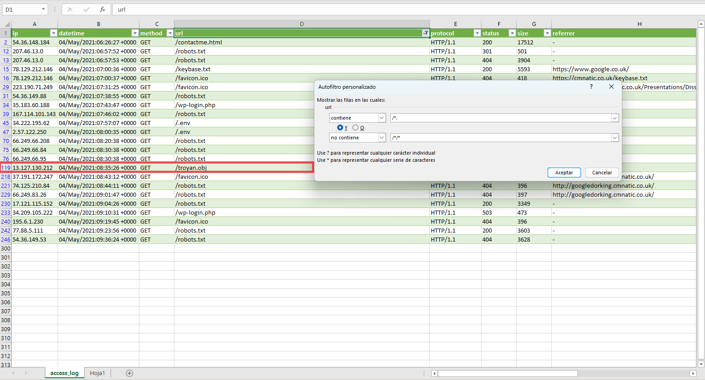
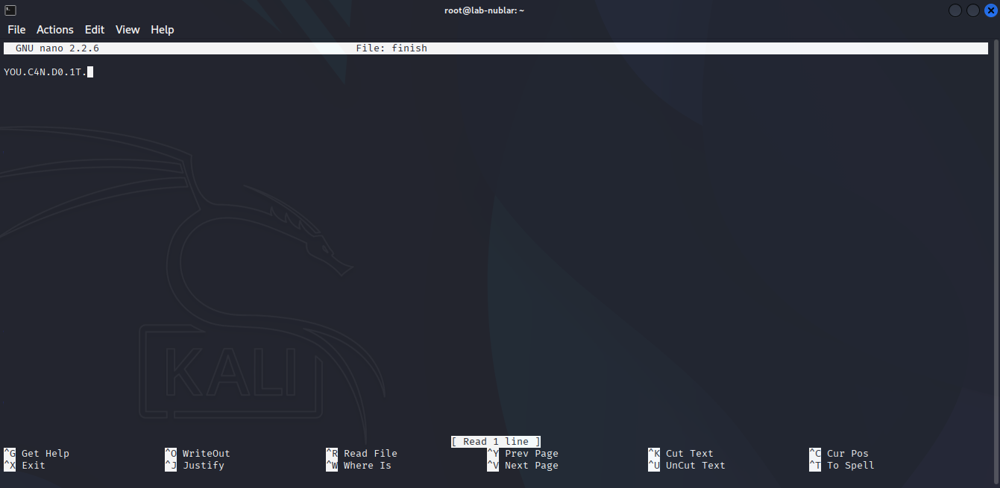

*31 / Julio / 2025 - MF0486*
# Examen práctico 1
## Contenido

- [Task 7 - Exploración inicial](#task-7---exploración-inicial)  
- [Task 8 - Reconocimiento del host](#task-8---reconocimiento-del-host)  
- [Task 9 - Reconocimiento del Web Site](#task-9---reconocimiento-del-web-site)  
- [Task 10 - Iniciando el desarrollo](#task-10---iniciando-el-desarrollo)  
- [Task 11 - Accionando keys](#task-11---accionando-keys)  
- [Task 12 y 13 - Accediendo al host y Reconocimiento interno](#task-12-y-13---accediendo-al-host-y-reconocimiento-interno)  
- [Task 14 - La Madriguera](#task-14---la-madriguera)  
- [Conclusiones](#conclusiones)  

## Task 7 - Exploración inicial 
#### Ini:

- Arrancamos la máquina desde TryHackMe.com.
- Iniciamos la exploración; Para ello vamos a verificar que la máquina está viva y latente. Usamos el comando `ping`, con la opción `-h` nos muestra la ayuda (flags).

Comenzamos con `ping XX.XX.XXX.XXX` para llamar al servidor y esperar respuesta. Podemos establecer el contedo de cuantas respuestas queremos recibir antes de parar el ping `ping -c 6 XX.XX.XXX.XXX`, en este ejercicio usamos 6.

**Ejecución:**
```bash
$ ping -c 6 XX.XX.XXX.XXX

PING XX.XX.XXX.XXX (XX.XX.XXX.XXX) 56(84) bytes of data.
64 bytes from XX.XX.XXX.XXX: icmp_seq=1 ttl=63 time=40.5 ms
64 bytes from XX.XX.XXX.XXX: icmp_seq=2 ttl=63 time=40.7 ms
64 bytes from XX.XX.XXX.XXX: icmp_seq=3 ttl=63 time=40.6 ms
64 bytes from XX.XX.XXX.XXX: icmp_seq=4 ttl=63 time=41.6 ms
64 bytes from XX.XX.XXX.XXX: icmp_seq=5 ttl=63 time=40.7 ms
64 bytes from XX.XX.XXX.XXX: icmp_seq=6 ttl=63 time=41.1 ms

--- XX.XX.XXX.XXX ping statistics ---
6 packets transmitted, 6 received, 0% packet loss, time 5012ms
rtt min/avg/max/mdev = 40.499/40.861/41.605/0.379 ms
```
---
## Task 8 - Reconocimiento del host
#### Recon:

Una de las herramientas útiles que viene preinstalada en Kali Linux es **Nmap**. Con Nmap podemos escanear un target específico y mapear *(reconocimiento activo)* su red con el fin de descubrir información valiosa sobre el objetivo que nos puede ayudar en el momento de planificar una intrusión.

Inicamos el mapeo mediante el comando `nmap -sT XX.XX.XXX.XXX`, en este caso mediante la flag `-sT` la cual especifica un mapeo del protocolo TCP.

**Ejecución:**
```bash
$ nmap -sT XX.XX.XXX.XXX

Starting Nmap 7.95 ( https://nmap.org ) at 2025-07-31
Nmap scan report for XX.XX.XXX.XXX
Host is up (0.042s latency).
Not shown: 998 closed tcp ports (conn-refused)
PORTSTATE SERVICE
22/tcp open  ssh
80/tcp open  http
```
Nos muestra que hay operativos (abiertos) tanto el puerto **ssh** (22) como el **http** (80).

---
## Task 9 - Reconocimiento del Web Site
#### Pwned!

Abrimos el navegador y accedemos a la dirección `IP:PUERTO`, en este caso al puerto **80** (hxxp://XX[.]XX[.]XXX[.]XXX:80).

- A primera vista visualizamos lo que aparentemente parece una imágen con el siguiente texto: You've Been Pwned!
- El texto se puede seleccionar, entonces se encuentra superpuesto. De fondo se puede observar un código binario bien estructurado, es posible que sea un mensaje oculto.
- Procedemos a inspeccionar elemento *(con CTRL+U, CMD+U ó botón derecho del ratón, inspeccionar)*. En la parte superior del código fuente observamos que la imagen fue creada con el programa de vectorización Inkscape, así como otros datos relevantes como: la hora, autor, nombre del archivo, formato...

```js
xmlns:dc="hxxp[://]purl[.]org/dc/elements/1[.]1/"
xmlns:cc="hxxp[://]creativecommons[.]org/ns#"
xmlns:rdf="hxxp[://]www[.]w3[.]org/1999/02/22-rdf-syntax-ns#"
xmlns:svg="hxxp[://]www[.]w3[.]org/2000/svg"
xmlns="hxxp[://]www[.]w3[.]org/2000/svg"
xmlns:xlink="hxxp[://]www[.]w3[.]org/1999/xlink"
xmlns:sodipodi="hxxp[://]sodipodi[.]sourceforge[.]net/DTD/sodipodi-0.dtd"
xmlns:inkscape="hxxp[://]www[.]inkscape[.]org/namespaces/inkscape"
width="116.29175mm"
height="174.61578mm"
viewBox="0 0 116.29175 174.61578"
version="1.1"
id="svg8"
inkscape:version="0.92.5 (2060ec1f9f, 2020-04-08)"
sodipodi:docname="pwnedletter.svg"
inkscape:export-filename="/home/dnedry/Desktop/pwnedletter.png"
inkscape:export-xdpi="96"
inkscape:export-ydpi="96">>
```
Seleccionamos aquella información relevante y la guardamos en un documento de fácil acceso.

---
## Task 10 - Iniciando el desarrollo
#### PHP:

Investigamos cómo funciona PHP, un lenguaje de backend utilizado en el desarrollo web y enfocado en el procesamiento y comunicación desde el servidor.

Una de las caracterísitcas de PHP es la de informar al cliente mediante los códigos de respuesta HTTP sobre el estado de la comunicación cliente-servidor.

```
1xx informational response – the request was received, continuing process
2xx successful – the request was successfully received, understood, and accepted
3xx redirection – further action needs to be taken in order to complete the request
4xx client error – the request contains bad syntax or cannot be fulfilled
5xx server error – the server failed to fulfil an apparently valid request
```
Esta información es relevante para entender qué nos quiere comunicar el servidor cuando intentamos obtener información sobre un sitio web.

En este caso vamos a probar con encontrar si existe el archivo `robots.txt` en el servidor y si tiene información relevante.

El servidor nos devuelve el código de error `404 - Not Found`.

---
## Task 11 - Accionando keys
#### GPG:

- Procedemos a descargar el archivo de la tarea 11: *key-shadow-vault-1753955334713.zip*.

Al abrir el archivo, nos aparece un documento con extensión **.php**, lo cual nos da una pista de cual podría ser la contraseña. En el la tarea 11, ya nos preguntan *Cuando el servidor ha recibido y entendido la petición, pero se niega a autorizarla **¿qué error nos muestra?***

Una búsqueda rápida en la sección 4XX de las respuestas de error nos indica que la contraseña es **403** (del error 403 Forbidden).

Al extraer el archivo mi_key.php y realizar `cat mi_key.php` observamos que en realidad se trata de un archivo con una clave GPG, así que procedemos a cambiar la extensión del archivo mediante el comando `mv mi_key.php mi_key.asc`.

Mediante el comando `gpg --import` importamos la key al directorio .gnupg de nuestra máquina, complementando con `--import-options show-only mi_key.asc` para la key en consola. 

```bash
$ gpg --import --import-options show-only mi_key.asc

gpg: keybox '/home/kali/.gnupg/pubring.kbx' created
gpg: /home/kali/.gnupg/trustdb.gpg: trustdb created

pub   rsa2048 2025-03-04 [SCEA]
      D4CD909BEACEE39CCE7ED3C7EA48AC09921574EA
uid   Dodgson <PASS:{Dodgson}>
```

- En este momento, ya dispnemos del nombre de usuario (**dnedry**), host (**XX.XX.XXX.XXX**) y contraseña (**Dodgson**).
---
## Task 12 y 13 - Accediendo al host y Reconocimiento interno
#### SSH:

Tal y como vimos en la tarea 8, el puerto 22 se encuentra disponible.

```bash
$ nmap -sT XX.XX.XXX.XXX

Starting Nmap 7.95 ( https://nmap.org ) at 2025-07-31
Nmap scan report for XX.XX.XXX.XXX
Host is up (0.042s latency).
Not shown: 998 closed tcp ports (conn-refused)
PORTSTATE SERVICE
22/tcp open  ssh
80/tcp open  http
```
Así que procedemos a infiltrarnos via ssh mediante el comando `ssh dnedry@XX.XX.XXX.XXX` y la contraseña `Dodgson`.

```bash
$ ssh dnedry@XX.XX.XXX.XXX
dnedry@XX.XX.XXX.XXX's password: 

Welcome to Ubuntu 14.04.6 LTS (Sys/InGen 2.0a3.01-A00 x86_64)

 * Documentation:  https://help.ubuntu.com/

  System information as of Fri Aug  1 02:04:14 CEST 2025

  System load:  0.0               Processes:           92
  Usage of /:   8.4% of 15.33GB   Users logged in:     0
  Memory usage: 8%                IP address for eth0: XX.XX.XXX.XXX
  Swap usage:   0%

  Graph this data and manage this system at:
    https://landscape.canonical.com/

Your Hardware Enablement Stack (HWE) is supported until April 2019.
Last login: Fri Aug  1 02:04:14 2025 from ip-XX-XX-BBB-BBB.eu-west-1.compute.internal
```

Ya estamos dentro!

Ahora revisamos en qué directorio nos encontramos mediante el comando `pwd`.

```bash
dnedry@lab-nublar:~$ pwd
/home/dnedry
```

A continuación, mediante `getent passwd` y encadenamos con `| wc -l` para contar las líneas y mostrar el número de usuarios disponibles (1 usuario por línea).

```bash
dnedry@lab-nublar:~$ getent passwd | wc -l
25
```

Vamos a obtener más información sobre el usuario con el cual hemos accedido mediante `ssh`. Para ello usamos el comando `get ent nombreUsuario`. Podemos observar que tenemos disponible el nombre del propietario del usuario *(Dennis Nedry)* así como su puesto de trabajo *(Computer Programmer)*.

```bash
dnedry@lab-nublar:~$ getent passwd dnedry 
dnedry:x:1000:1000:Dennis Nedry,Computer Programmer,,:/home/dnedry:/bin/bash
```
Ya que estamos, aprovechamos para revisar el estado de `sudo` del usuario. Nos irá bien para escalar a `root`.

```bash
dnedry@lab-nublar:~$ groups dnedry | grep -w sudo
dnedry : dnedry sudo
```

Procedemos a obtener más información de relevancia sobre la máquina, por ejemplo el idioma mediante la localización. Para ello usamos `locale`.

```bash
dnedry@lab-nublar:~$ locale
LANG=en_US.UTF-8
LANGUAGE=en_US:en
LC_CTYPE="en_US.UTF-8"
LC_NUMERIC="en_US.UTF-8"
LC_TIME="en_US.UTF-8"
LC_COLLATE="en_US.UTF-8"
LC_MONETARY="en_US.UTF-8"
LC_MESSAGES="en_US.UTF-8"
LC_PAPER="en_US.UTF-8"
LC_NAME="en_US.UTF-8"
LC_ADDRESS="en_US.UTF-8"
LC_TELEPHONE="en_US.UTF-8"
LC_MEASUREMENT="en_US.UTF-8"
LC_IDENTIFICATION="en_US.UTF-8"
LC_ALL=
```
También nos interesa conocer la arquitectura del sistema, la versión del kernel...  Para ello, usamos el comando `uname -a`.

```bash
dnedry@lab-nublar:~$ uname -a
InGen System lab-nublar 2.0a3.01-A00 #1337 SMP Wed Mar  3 12:34:56 UTC 1993 x86_64 x86_64 x86_64 Sys/InGen
```
Si queremos ser mas específicos y únicamente mostrar el kernel, usaríamos el comando `uname` con la flag `-s`.

```bash
dnedry@lab-nublar:~$ uname -s
InGen System
```

Verificamos el host mediante el comando `hostname`.

```bash
dnedry@lab-nublar:~$ hostname
lab-nublar
```
## Task 14 - La Madriguera
##### Logs:
Debido a que la máquina se encuentra infectada con un troyano, nos desplazamos al directorio donde se guardan los archivos de registro del sistema: `/var/log`. Para ello empleamos el comando `cd /var/log`.

```bash
dnedry@lab-nublar:~$ cd /var/log
```
Ya estando en el direcotrio de registros, elevamos privilegios mediante `sudo su` y la contraseña del usuario sudo `Dodgson`.

```bash
dnedry@lab-nublar:~$ sudo su
[sudo] password for dnedry: 
root@lab-nublar:/home/dnedry# whoami
root
```
A continuación, lanzamos servidor http en el puerto 4141 mediante el comando `python3 -m http.server 4141` para poder descargar los archivos de registro con extensión .log.
```bash
root@lab-nublar:/var/log# python3 -m http.server 4141
Serving HTTP on 0.0.0.0 port 4141 ...
10.21.225.157 - - [01/Aug/2025 04:10:44] "GET / HTTP/1.1" 200 -
10.21.225.157 - - [01/Aug/2025 04:10:44] code 404, message File not found
10.21.225.157 - - [01/Aug/2025 04:10:44] "GET /favicon.ico HTTP/1.1" 404 -
10.21.225.157 - - [01/Aug/2025 04:10:46] "GET /access.log HTTP/1.1" 200 -
```
Accedemos mediante el navegador a `hxxp://XX.XX.XXX.XXX:4141` y procedemos a descargar `access.log`.

[imagen]

Podemos abrir el archivo `access.log` con cualquier editor de texto. Pero para mas comodidad, se puede adaptar el archivo .log a .csv para mejor manejo de datos. Podemos lograrlo con este pequeño script en Python.

```python
import re
import csv

input_log = 'access.log'
output_csv = 'access_log.csv'

log_pattern = re.compile(
    r'(?P<ip>\S+) - - \[(?P<datetime>[^\]]+)\] '
    r'"(?P<method>\S+)? (?P<url>\S+)? (?P<protocol>[^"]+)?" '
    r'(?P<status>\d{3}) (?P<size>\d+|-) '
    r'"(?P<referrer>[^"]*)" "(?P<user_agent>[^"]*)"'
)

rows = []
with open(input_log, 'r', encoding='utf-8') as infile:
    for line in infile:
        match = log_pattern.match(line)
        if match:
            rows.append(match.groupdict())

if rows:
    with open(output_csv, 'w', newline='', encoding='utf-8') as outfile:
        writer = csv.DictWriter(outfile, fieldnames=rows[0].keys())
        writer.writeheader()
        writer.writerows(rows)
    print(f"Ejecutado! Disponible en: {output_csv}")
else:
    print("Error, revisa el archivo")
```
Se ejecuta mediante el comando `python`.
```bash
$ python log_csv.py access.log 
```
Ahora con el archivo abierto, podemos aplicar filtros y seleccionar unicamente aquellos datos que necesitamos. En este caso aplicamos filtro por objeto con nombre desconocido mediante el uso de `/*.` y descartamos todo aquello que pueda ser una ruta mediante el filtro `/*/*` (en la columna **url**).

Aplicado el filtro, ubicamos el archivo sospechoso `troyan.obj` en la fila 119. El acceso se produjo desde la dirección IP `13.127.130.212` a fecha `04/May/2021` a las `08:35:26` 



```log
13.127.130.212,04/May/2021:08:35:26 +0000,GET,/troyan.obj,lang=en HTTP/1.1,404,360,-,"Mozilla/5.0 (Windows NT 10.0; Win64; x64) AppleWebKit/537.36 (KHTML, like Gecko) Chrome/77.0.3865.120 Safari/537.36"
```

##### Buscando la madriguera:

El troyano usa una extensión `.obj`, comunmente utilzada para modelo 3D por programas como Blender, Maya, Cinema 4D... y con capacidad de ejecutar malware escrito en C o C++.

Como norma general, el malware busca crear persistencia en la máquina infectada, por ello se implementan diferentes técnicas para evadir ser detectados.

Vamos a revisar los procesos para identificar si existe algun proceso sospechoso, para ello en la terminal usamos el comando `top`.

```bash
dnedry@lab-nublar:/var/log$ sudo top
[sudo] password for dnedry: 

top - 05:03:05 up  1:29,  1 user,  load average: 0.00, 0.00, 0.00
Tasks:  92 total,   1 running,  91 sleeping,   0 stopped,   0 zombie
%Cpu(s):  0.0 us,  0.0 sy,  0.0 ni,100.0 id,  0.0 wa,  0.0 hi,  0.0 si,  0.0 st
KiB Mem:    991360 total,   245044 used,   746316 free,    10932 buffers
KiB Swap:  4190204 total,        0 used,  4190204 free.   164432 cached Mem

  PID USER      PR  NI    VIRT    RES    SHR S  %CPU %MEM     TIME+ COMMAND
    1 root      20   0   33356   3992   2740 S   0.0  0.4   0:01.24 init
    2 root      20   0       0      0      0 S   0.0  0.0   0:00.00 kthreadd 
    3 root      20   0       0      0      0 S   0.0  0.0   0:00.00 ksoftirqd/0 
    5 root       0 -20       0      0      0 S   0.0  0.0   0:00.00 kworker/0:0H
    6 root      20   0       0      0      0 S   0.0  0.0   0:00.04 kworker/u4:0
    7 root      20   0       0      0      0 S   0.0  0.0   0:00.02 rcu_sched
    8 root      20   0       0      0      0 S   0.0  0.0   0:00.00 rcu_bh
    9 root      rt   0       0      0      0 S   0.0  0.0   0:00.00 migration/0
   10 root      rt   0       0      0      0 S   0.0  0.0   0:00.01 watchdog/0
   11 root      rt   0       0      0      0 S   0.0  0.0   0:00.01 watchdog/1
   12 root      rt   0       0      0      0 S   0.0  0.0   0:00.00 migration/1
   13 root      20   0       0      0      0 S   0.0  0.0   0:00.00 ksoftirqd/1
   14 root      20   0       0      0      0 S   0.0  0.0   0:00.00 kworker/1:0
   15 root       0 -20       0      0      0 S   0.0  0.0   0:00.00 kworker/1:0H
   16 root      20   0       0      0      0 S   0.0  0.0   0:00.00 kdevtmpfs
   17 root       0 -20       0      0      0 S   0.0  0.0   0:00.00 netns
   18 root       0 -20       0      0      0 S   0.0  0.0   0:00.00 perf
   19 root      20   0       0      0      0 S   0.0  0.0   0:00.00 khungtaskd
   20 root       0 -20       0      0      0 S   0.0  0.0   0:00.00 writeback
   21 root      25   5       0      0      0 S   0.0  0.0   0:00.00 ksmd
   22 root      39  19       0      0      0 S   0.0  0.0   0:00.00 khugepaged  
   23 root       0 -20       0      0      0 S   0.0  0.0   0:00.00 crypto 
   24 root       0 -20       0      0      0 S   0.0  0.0   0:00.00 kintegrityd
```

A primera vista no se aprecia ningún proceso aparentemente malicioso, así que vamos a cambiar de táctica e intentar ubicar el archivo `troyan.obj` en el sistema. Para ello salimos del direcotrio de log y escalamos al direcotorio raíz `/`, a continuación usamos find con la siguiente estructura: `sudo find / -type f -name "troyan.obj" 2>/dev/null`. 

```bash
dnedry@lab-nublar:/$ sudo find / -type f -name "troyan.obj" 2>/dev/null
dnedry@lab-nublar:/$ 
```

No nos devuelve ningún resultado, así que substituimos el nombre del arcivo por un `*` y ejecutamos (`sudo find / -type f -name "*.obj" 2>/dev/null`).


```bash
dnedry@lab-nublar:/var$ cd ..
dnedry@lab-nublar:/$ sudo find / -type f -name "*.obj" 2>/dev/null

/home/dnedry/.cache/. /.troyan/Whte rbt.obj
```

Mediante la técnica de *Self-Renaming*, el troyano ha cambiado de nombre a `Whte rbt.obj` para evitar ser encontrado. Observamos que el troyano se encuentra en un directorio oculto: `.troyan`, dentro de otro directorio también oculto ubicado en `.cache`. Este directorio superior tiene un nombre inusual: `. ` *(punto seguido de un espacio)*, lo cual, si bien es técnicamente válido, está diseñado para pasar desapercibido en listados y dificultar su detección visual.

Vamos a intentar acceder al directorio oculto mediante el comando `dnedry@lab-nublar:~$ cd "/home/dnedry/.cache/. /.troyan/"`.

```bash
dnedry@lab-nublar:~$ cd "/home/dnedry/.cache/. /.troyan/"
-bash: cd: /home/dnedry/.cache/. /.troyan/: Permission denied
```
Se necesitan privilegios elevados a los que dispone el usuario dnedry, mediante `sudo su` cambiamos al usuario `root` y volvemos a intentar acceder al directorio oculto `.troyan`.

- Una vez dentro, listamos el contenido mediante el comando `ls -lah`. 

```bash
root@lab-nublar:/home/dnedry/.cache/. /.troyan# ls -lah
total 12K
d--------- 2 www-data www-data 4.0K Mar  4 00:26 .
drwx------ 3 dnedry   dnedry   4.0K Mar  4 05:26 ..
---------x 1 www-data www-data   37 Mar  4 00:26 Whte rbt.obj
```
Analizando el directorio, podemos observar que el archivo unicamente puede ser ejecutado por "otros" `---------x` y que el propietario es `www-data`, por tanto quien provocó la incidencia. 

Mediante el comando `nano` accedemos al contenido de `Whte rbt.obj`, donde ubicaremos la flag `FLAG{YOU DIDN'T SAY THE MAGIC WORD!}`.

#### Últimos pasos

- Vamos a ubicar la última flag, para ello vamos al directorio de `root` mediante el comando `cd` y verificamos con `pwd`.

```bash
root@lab-nublar:~# cd 
root@lab-nublar:~# pwd
/root
```
- listamos el contenido del directorio mediante `ls`.
```bash
root@lab-nublar:~# ls
finish.tar
```
- Observamos que existe un archivo con extensión `.tar`, pertenece a tipo **t**ape **ar**chive o archivo de cinta, el cual se usa para agrupar un directorio manteniendo la estructura y configuración sin realizar compresión.

- Mediante el comando `tar -tf` podemos visualizar el contenido y la estructura del archivo `.tar` sin necesidad de extraerlo.

```bash
root@lab-nublar:~# tar -tf finish.tar 
finish
```

- Extraemos el archivo `finish` mediante el comando `tar -xf`.

```bash
root@lab-nublar:~# tar -xf finish.tar 
root@lab-nublar:~# ls
finish  finish.tar
```
- Mediante `cat`, revisamos los permisos y a quien pertenece. Una vez mas usamos el comando `nano` para ver el contenido del archivo.

```bash
root@lab-nublar:~# cat finish
-rw-r--r-- 1 root root 16 Mar  4 05:42 finish
root@lab-nublar:~# nano finish
```

Ubicamos la última flag en `finish`: `YOU.C4N.D0.1T.`



---

## Conclusiones

Mediante el uso de herramientas como `ping` y `nmap` se ha logrado realizar una exploración inicial del host para detectar e identificar posibles vectores de acceso.

Una vez verificada la comunicación con el host e identificados los puertos abiertos, se procede a la inspección del web site disponible en el puerto http (XX.XX.XXX.XXX:80).

Gracias a los metadatos del contendio mostrado en el web site, se ha podido recabar información sobre el usuario del host, el cual nos facilita el acceso mediante `SSH`.

Mediante el uso del comando `GPG`, se ha podido importar la clave de ssh, así como mostrarla en terminal para conseguir el acceso al host.

Una vez dentro del host, mediante el uso del comando `getent passwd`, conseguimos enumerar el número de usuarios, así como recabar más información sobre el usuario actual.

A continuación, con el uso de los comandos `uname`, `hostname` y `locale` se pudo indentificar y recabar información interna sobre host.

Por último, se realizó un análisis del archivo de registro `acceso.log`, donde se pudo identificar la descarga del archivo malicioso `toryan.obj`, el cual mediante la técnica de `self-renaming` ha cambiado de nombre a `Whte rbt.obj` y se ha ocultado en el directorio oculto `.cache` para evadir ser localizado (se ha ubicado mediante el comando `find`).

**Puntos clave**:

- Puertos abiertos en la máquina target.
- Contenido publicado sin limpieza de metadatos.
- Usuario del host target con permisos su. 
- Escalada de privilegios mediante `sudo su`.
- Identificación del archivo maliciso y usuario que lo descargó.
- Ubicación del archvo malicioso y extracción de la flag.
---

EOF

